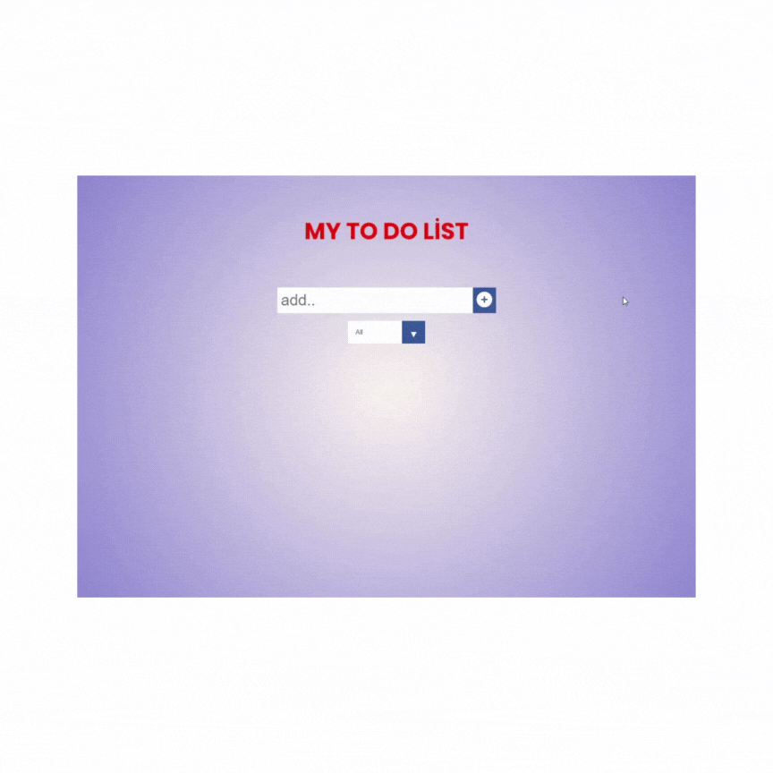

# To-Do List Uygulaması

Bu basit To-Do List uygulaması, kullanıcılara yapılacak görevleri eklemeleri, işaretleme ve silmeleri için bir araç sunar. Ayrıca, bu görevlerin durumlarına göre filtreleme yapabilirler.

## Nasıl Kullanılır

1. Uygulamayı canlı olarak denemek için [şu bağlantıya](https://mytodo38.netlify.app/) gidin.

2. Uygulamayı yerel olarak çalıştırmak için aşağıdaki adımları takip edin:

   - Bu depoyu klonlayın: `git clone <repository-url>`
   - Proje klasörüne gidin: `cd proje-klasoru`
   - Gerekli bağımlılıkları yüklemek için: `npm install`
   - Uygulamayı başlatmak için: `npm start`
   - Tarayıcınızda `http://localhost:3000` adresini açın.

3. "Add" düğmesine tıklayarak yeni bir görev ekleyin. Eğer görev adı boşsa uyarı alırsınız.

4. Eklediğiniz görevleri işaretlemek için yanlarındaki "Complete" düğmesine tıklayabilirsiniz. İşaretlenmiş görevleri tekrar geri almak için aynı düğmeye tekrar tıklayabilirsiniz.

5. Bir görevi silmek için yanlarındaki "Trash" düğmesine tıklayabilirsiniz.

6. Görevleri "All," "Completed," ve "Uncompleted" olmak üzere üç farklı filtreleme seçeneği ile görüntüleyebilirsiniz.

## Kullanılan Teknolojiler

- HTML
- CSS
- JavaScript
- Local Storage (Görevlerin yerel olarak saklanması için)

